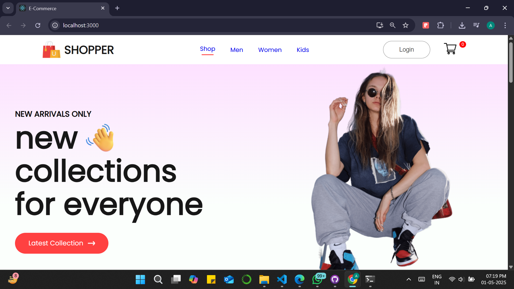
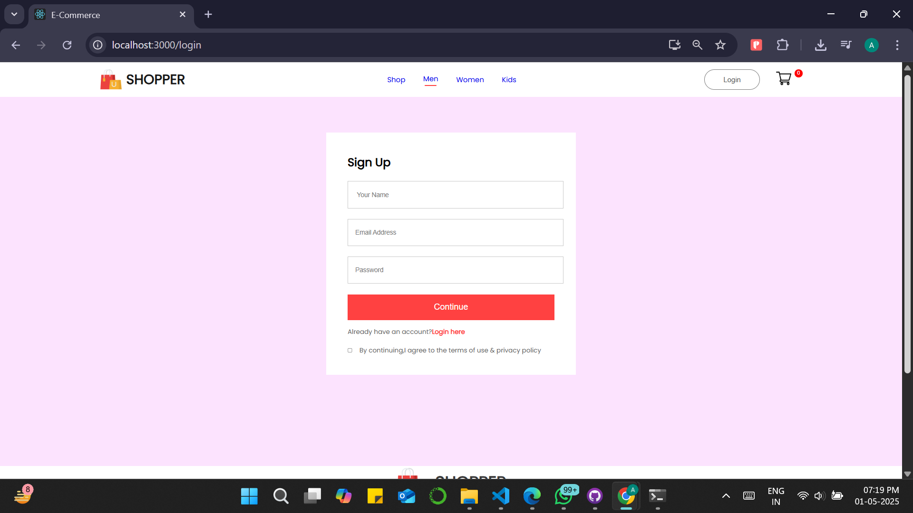
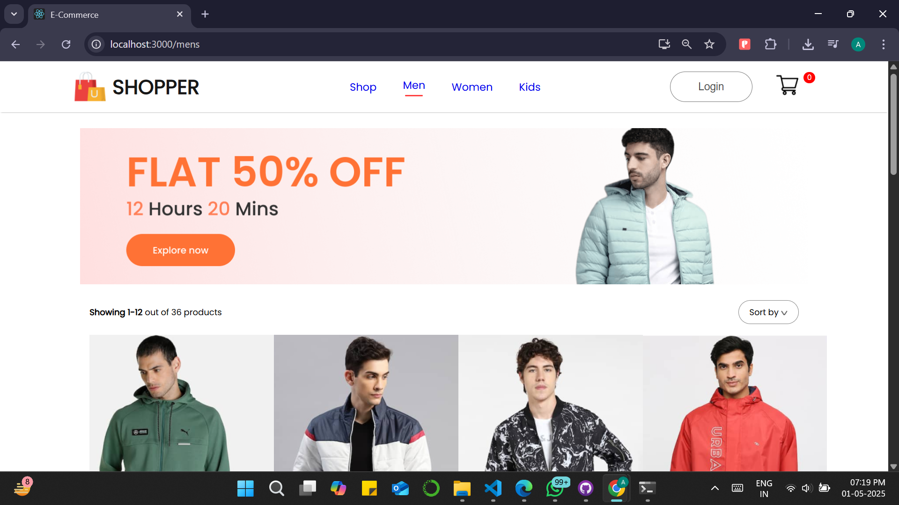
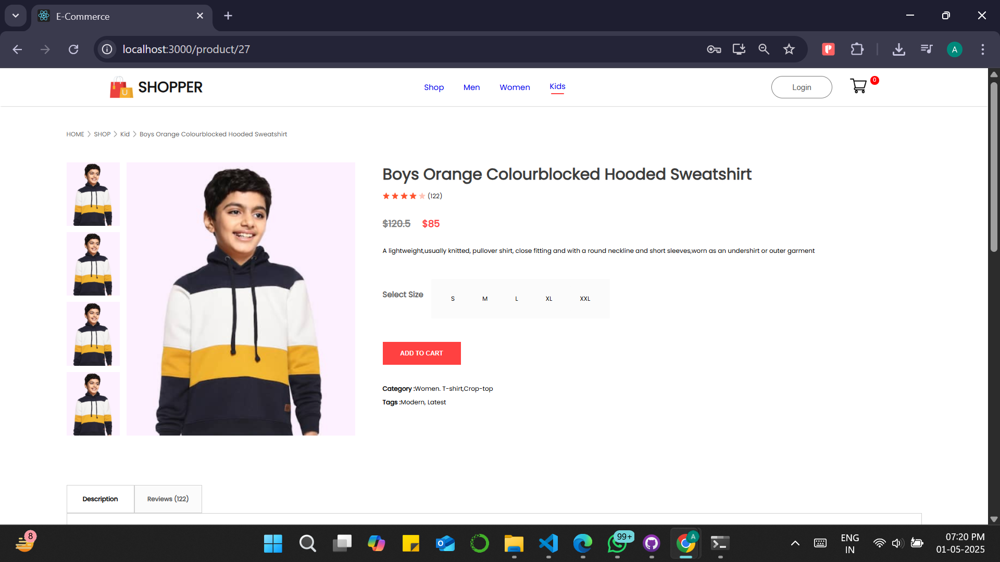

# E-commerce Website

A fully functional e-commerce web application built with React.

## Features

- Product listing
- Shopping cart
- Responsive design
- User authentication 
- Checkout flow

## Technologies Used

- React
- JavaScript
- CSS (or Tailwind/Bootstrap)
- Backend 

## Getting Started

```bash
git clone https://github.com/anushhaaa12/Ecommerce-Website.git
cd Ecommerce-Website/frontend
npm install
npm start


## 📸 Screenshots

### 🏠 Homepage


### 🔐 Loginpage


### 🛍️ Product Page


### 🛒 Cart



